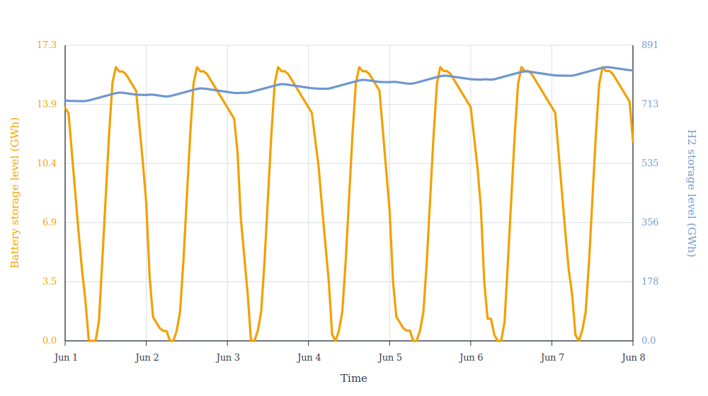

# PV, Battery, And Hydrogen With A Coarse Hydrogen Mesh

Multi-mesh models are useful when one part of a system needs fine temporal
detail while another part can be represented more coarsely.

The system has PV, battery storage, electricity consumption, an electrolyser,
hydrogen storage, and hydrogen consumption, plus an electricity node and a
hydrogen node.

The PV profile is fully synthetic and simplified, but it has both daily and
seasonal variation. The battery can handle the day-night pattern, but the
seasonal PV shortage has to be covered by hydrogen stored over much longer periods.

The code below builds the same system twice:

  * `hourly`: all components and nodes use the 8760-step hourly mesh as a reference case;
  * `mixed`: only the hydrogen node, hydrogen consumption, and hydrogen storage
    use a 2190-step 4-hour mesh.

The electrolyser is modelled on the fine time mesh, including hydrogen
production, but its hydrogen production is projected onto the coarser hydrogen
node mesh when performing the node balance. This keeps the fast
electricity-side structure while using fewer variables on the hydrogen side.

```jldoctest mixed_mesh_hydrogen; output = false
using Nosy
using HiGHS
import JuMP
import JuMP: set_silent

function build_power_hydrogen_case(h2_mesh)
    power_mesh = TimeMesh(fill(1//1, 8760))
    s = Sim(Model(HiGHS.Optimizer); mesh=power_mesh)
    set_silent(model(s))

    power = EnergyCarrier("electricity", s)
    hydrogen = MassCarrier("hydrogen", s; energy=1.0)

    normal_day = [
        0.0, 0.0, 0.0, 0.0, 0.0, 0.03,
        0.15, 0.35, 0.58, 0.78, 0.92, 1.0,
        0.96, 0.86, 0.68, 0.45, 0.22, 0.06,
        0.0, 0.0, 0.0, 0.0, 0.0, 0.0,
    ]
    seasonal = [
        0.35 + 0.65 * (0.5 + 0.5 * sin(2pi * (day - 80) / 365))
        for day in 1:365
    ]
    pv_profile = repeat(normal_day, 365) .* repeat(seasonal, inner=24)

    snapshot = Snapshot(s)

    electricity = Node("electricity", power, rule=:curtailed)
    h2 = Node("hydrogen", hydrogen; mesh=h2_mesh)

    pv = Component(
        "PV",
        ProfileSource(power, pv_profile; mesh=power_mesh),
        [
            VariableCapacity("output", energy),
            FixedCost(:capex, "output", energy, 200_000.),
        ],
    )
    connect!(snapshot, pv, electricity)

    battery = Component(
        "battery",
        BasicStorage(power, power, power, energy; eff_i=0.92, eff_o=0.92, mesh=power_mesh),
        [
            VariableCapacity("input", energy),
            FixedCost(:capex, "input", energy, 100_000.),
            Duration(4),
        ],
    )
    connect!(snapshot, battery, electricity)

    power_demand_profile = fill(300., length(pv_profile))
    power_demand = Component(
        "power demand",
        Demand(power, power_demand_profile; modifier=energy, mesh=power_mesh),
    )
    connect!(snapshot, power_demand, electricity)

    electrolyser = Component(
        "electrolyser",
        BasicConverter(power, hydrogen; ratio=0.70, modifier=energy, mesh=power_mesh),
        [
            VariableCapacity("input", energy),
            FixedCost(:capex, "input", energy, 200_000.),
        ],
    )
    connect!(snapshot, electrolyser, electricity)
    connect!(snapshot, electrolyser, h2)

    h2_consumption = Component(
        "H2 consumption",
        Demand(hydrogen, 1500.; modifier=mass, mesh=h2_mesh),
    )
    connect!(snapshot, h2_consumption, h2)

    h2_storage = Component(
        "H2 storage",
        BasicStorage(hydrogen, hydrogen, hydrogen, mass; mesh=h2_mesh),
        [
            VariableCapacity("level", mass),
            FixedCost(:capex, "level", mass, 1.0),
        ],
    )
    connect!(snapshot, h2_storage, h2)

    optimize!(snapshot, cost(snapshot))
    result = extract(snapshot)

    return (
        snapshot=snapshot,
        result=result,
        variables=JuMP.num_variables(model(s)),
        constraints=JuMP.num_constraints(model(s); count_variable_in_set_constraints=false),
    )
end

hourly_mesh = TimeMesh(fill(1//1, 8760))
h2_4h_mesh = TimeMesh(fill(4//1, 2190))

hourly = build_power_hydrogen_case(hourly_mesh)
mixed = build_power_hydrogen_case(h2_4h_mesh)

# output

(snapshot = Snapshot with 6 component(s) and 2 node(s), result = Snapshot with 6 component(s) and 2 node(s), variables = 41614, constraints = 59130)
```

The mixed model removes the hourly hydrogen storage and hydrogen node balance
variables and constraints. In this case the reduction is substantial:

```jldoctest mixed_mesh_hydrogen
julia> hourly.variables, mixed.variables
(61324, 41614)

julia> 100 * (1 - mixed.variables / hourly.variables)
32.14076055051856

julia> hourly.constraints, mixed.constraints
(78840, 59130)
```

A local run gives the following summary. Storage capacities are reported as
maximum energy level.

<table>
  <thead>
    <tr>
      <th rowspan="2">Case</th>
      <th colspan="4">Capacity</th>
      <th rowspan="2">Objective<br>(B€)</th>
      <th rowspan="2">Variables</th>
      <th rowspan="2">Constraints</th>
      <th rowspan="2">Solve time<br>(s)</th>
    </tr>
    <tr>
      <th>PV<br>(MW)</th>
      <th>Battery storage<br>(GWh)</th>
      <th>Electrolyser<br>(MW)</th>
      <th>H2 storage<br>(GWh)</th>
    </tr>
  </thead>
  <tbody>
    <tr>
      <td>Fine hourly mesh</td>
      <td>13,397.0</td>
      <td>16.05</td>
      <td>6,085.6</td>
      <td>1,967.50</td>
      <td>4.299740</td>
      <td>61,324</td>
      <td>78,840</td>
      <td>29.98</td>
    </tr>
    <tr>
      <td>Mixed H2 4-hour mesh</td>
      <td>13,397.0</td>
      <td>16.05</td>
      <td>6,085.6</td>
      <td>1,962.88</td>
      <td>4.299735</td>
      <td>41,614</td>
      <td>59,130</td>
      <td>19.03</td>
    </tr>
  </tbody>
</table>

Solve times are hardware dependent.

The electricity demand gives the battery a short-term balancing role on the
fine power mesh. Without such an electricity-side use, the battery would only
be valuable when PV production cannot be used directly by the electrolyser in
the same hour. In low-PV winter periods that would only add storage losses, so
the optimal battery level could reasonably stay flat. Here the battery operates
throughout the year:

```jldoctest mixed_mesh_hydrogen
julia> battery_input = balance(hourly.result, "battery", :input, energy; collapse=false, aggregate=true);

julia> daily_battery_input = [sum(battery_input[(24 * (day - 1) + 1):(24 * day)]) for day in 1:365];

julia> findfirst(>(1e-6), daily_battery_input), findlast(>(1e-6), daily_battery_input)
(1, 365)
```

The June 1 to June 8 view of the hourly reference run shows the daily battery
cycle and the slower hydrogen inventory movement:



The seasonal PV profile makes hydrogen storage a long-term balancing resource:
the optimal level capacity is more than 1000 hours of flat hydrogen
consumption. The main investment decisions are still almost unchanged between
the two meshes. PV, battery, and electrolyser capacities are the same to the
displayed precision; only the explicit hydrogen storage level changes slightly
because it is represented on 4-hour intervals:

```jldoctest mixed_mesh_hydrogen
julia> table(hourly.result, capacity)
1×6 DataFrame
 Row │ H2 consumption  H2 storage  PV       battery  electrolyser  power demand
     │ Float64         Float64     Float64  Float64  Float64       Float64
─────┼──────────────────────────────────────────────────────────────────────────
   1 │            0.0    1.9675e6  13397.0  4012.51        6085.6           0.0

julia> table(mixed.result, capacity)
1×6 DataFrame
 Row │ H2 consumption  H2 storage  PV       battery  electrolyser  power demand
     │ Float64         Float64     Float64  Float64  Float64       Float64
─────┼──────────────────────────────────────────────────────────────────────────
   1 │            0.0   1.96288e6  13397.0  4012.51        6085.6           0.0
```

The objective change is small compared with the reduction in model size:

```jldoctest mixed_mesh_hydrogen
julia> cost(hourly.result), cost(mixed.result)
(4.299739912750358e9, 4.299735289993873e9)

julia> 100 * (cost(mixed.result) / cost(hourly.result) - 1)
-0.00010751246770634992
```

A multi-mesh model is a good fit when different parts of the system are
associated with different time scales. The electricity side has sub-daily
structure that matters, but the hydrogen storage problem is mostly driven by
seasonal inventory movements. The coarser hydrogen node
effectively adds a small virtual buffer inside each 4-hour balance interval:
hydrogen production and consumption only need to match over the interval, not at
each individual hour. In this case that approximation is small compared with the
seasonal hydrogen storage requirement, and the hydrogen side has little
short-term variation of its own.

The same approximation would not be appropriate on the electricity side here.
PV production and battery operation have strong intra-day variation, so moving
the electricity node, PV, battery, or electrolyser electricity input to a coarse
4-hour mesh would hide the daily scarcity and surplus pattern and could give
wrong investment results.
