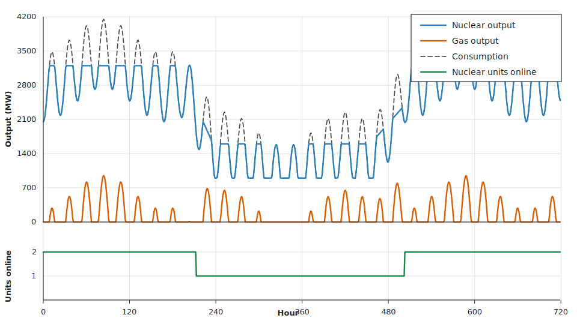

# Unit Commitment

This example dispatches a one-month electricity system with integer unit
commitment. Demand includes a two-week dip with a deep ten-day centre, which is
long enough for one of the two large nuclear units to shut down. The nuclear
plant has two fixed 1.6 GW units, a 50% minimum stable output ratio, a 48 hour
startup duration, a 24 hour shutdown duration, and a 168 hour minimum downtime.
Because integer commitment can be expensive, the horizon is limited to 720
hourly steps.

Nuclear fuel costs 10 €/MWh. Gas is more flexible here and costs 100 EUR/MWh, 
with three fixed 600 MW units. There is no investment decision.

```julia
using Nosy
using HiGHS
import JuMP: set_silent

# One month of hourly steps.
hours = 1:(24 * 30)
day_angle = 2pi .* ((hours .- 1) .% 24) ./ 24
week_angle = 2pi .* (hours .- 1) ./ (24 * 7)

demand = 3100 .+
    700 .* sin.(day_angle .- pi / 2) .+
    350 .* sin.(week_angle .- pi / 2)

during_dip = (8 * 24 + 1):(21 * 24)
for h in during_dip
    ramp_in = (h - first(during_dip) + 1) / 48
    ramp_out = (last(during_dip) - h + 1) / 48
    demand[h] -= 1_900.0 * min(ramp_in, ramp_out, 1.0)
end
demand = clamp.(demand, 900.0, 4200.0)

s = Sim(Model(HiGHS.Optimizer); mesh=TimeMesh(fill(1//1, length(hours))))
set_silent(model(s))

elec_carrier = EnergyCarrier("power", s)
snapshot = Snapshot(s)
grid = Node("grid", elec_carrier)

consumption = Component("demand", Demand(elec_carrier, demand))
connect!(snapshot, consumption, grid)

nuclear = Component(
    "nuclear",
    DispatchableSource(elec_carrier),
    [
        FixedCapacity("output", energy, 3_200.0; unitsize=1_600.0),
        VariableCost(:fuel, "output", energy, 10.0),
        UnitCommitment(
            "output",
            0.5;
            startup=48,
            shutdown=24,
            downtime=168,
            integer=true,
        ),
    ],
)
connect!(snapshot, nuclear, grid)

gas = Component(
    "gas",
    DispatchableSource(elec_carrier),
    [
        FixedCapacity("output", energy, 1_800.0; unitsize=600.0),
        VariableCost(:fuel, "output", energy, 100.0),
    ],
)
connect!(snapshot, gas, grid)

Nosy.optimize!(snapshot, cost(snapshot))
result = extract(snapshot)

```

Expected results:



The nuclear units carry all load up to their 3.2 GW fleet limit. The two-week
demand dip is deep enough that one large nuclear unit shuts down; nuclear
output is at or below one unit's 1.6 GW capacity for 240 hours, roughly ten
days. Gas is dispatched only when demand exceeds nuclear output, so it appears
in 279 of the 720 hours and peaks at 950 MW.
